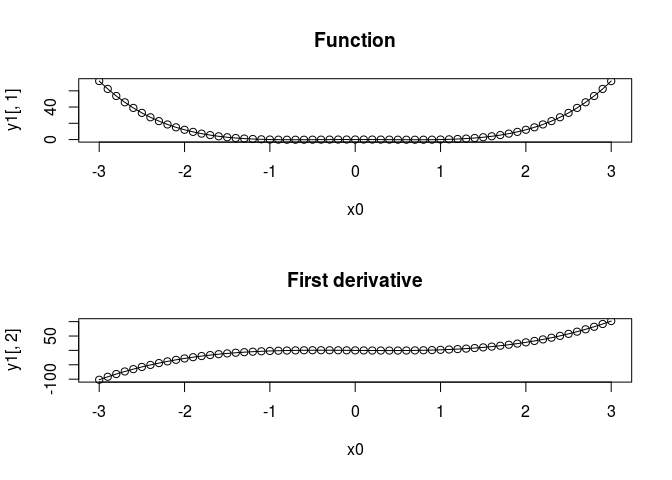
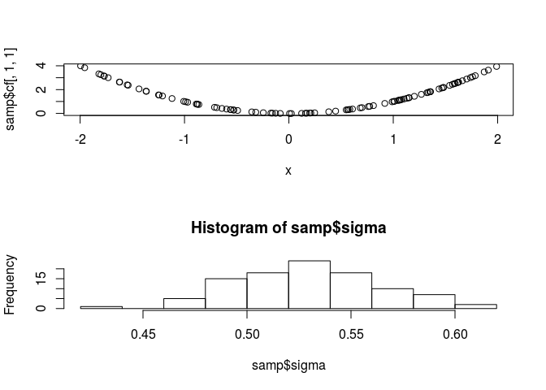

covafillr: Local Polynomial Regression of State Dependent Covariates in State-Space Models
==========================================================================================

Installing
----------

covafillr version can be installed from CRAN with

``` r
install.packages("covafillr")
```

The development version of covafillr can be installed with

``` r
devtools::install_github("calbertsen/covafillr")
```

### Installing with JAGS

To use `covafillr` with [`JAGS`](http://mcmc-jags.sourceforge.net/), JAGS must be installed before the `covafillr` package, and the package must be installed using the same compiler as JAGS is installed with.

On Unix(-like) systems, `pkg-config` is used to find the relevant paths to compile `covafillr` against `JAGS`, such as

``` sh
pkg-config --cflags jags
pkg-config --libs jags
```

    ## -I/usr/local/include/JAGS 
    ## -L/usr/local/lib -ljags

The package will only be installed with the JAGS module if the configure argument `--with-jags` is given.

On Windows, the `R` package `rjags` is used to find the paths. `covafillr` can be installed without using `rjags` by setting a system variable `JAGS_ROOT` to the folder where `JAGS` is installed, e.g., by running

``` r
Sys.setenv(JAGS_ROOT='C:/Program Files/JAGS/JAGS-4.1.0')
```

before installation. Similar to Unix(-like) systems, the package is only installed with the JAGS module if the system variable `USE_JAGS` is set, e.g., by running

``` r
Sys.setenv(USE_JAGS='yes')
```

Simple examples
---------------

Note that more examples are available in the inst/examples folder.

### Using from R

``` r
library(methods)
library(covafillr)
```

The package can be used from `R` to do local polynomial regression and a search tree approximation of local polynomial regression. Both are implemented with reference classes.

#### Local polynomial regression

The reference class for local polynomial regression is called `covafill`.

``` r
methods::getRefClass('covafill')
```

    ## Generator for class "covafill":
    ## 
    ## Class fields:
    ##                   
    ## Name:          ptr
    ## Class: externalptr
    ## Locked Fields: "ptr"
    ## 
    ## 
    ## Class Methods: 
    ##      "import", "getDegree", ".objectParent", "setBandwith", "residuals", 
    ##      "usingMethods", "show", "getClass", "untrace", "export", 
    ##      "copy#envRefClass", "initialize", ".objectPackage", "callSuper", 
    ##      "getDim", "copy", "getBandwith", "predict", "initFields", 
    ##      "getRefClass", "trace", "field"
    ## 
    ## Reference Superclasses: 
    ##      "envRefClass"

To illustrate the usage we simulate data.

``` r
fn <- function(x) x ^ 4 - x ^ 2
x <- runif(2000,-10,10)
y <- fn(x) + rnorm(2000,0,0.1)
```

An object of the reference class is created by

``` r
cf <- covafill(coord = x,obs = y,h = 10.0,p = 5L)
```

where h is the bandwith and p is the polynomial degree. Information about the class can be extracted (and changed) by the following functions:

``` r
cf$getDim()
```

    ## [1] 1

``` r
cf$getDegree()
```

    ## [1] 5

``` r
cf$getBandwith()
```

    ## [1] 10

``` r
cf$setBandwith(1.0)
```

    ## [1] 1

``` r
cf$getBandwith()
```

    ## [1] 1

To do local polynomial regression at a point, the `$predict` function is used.

``` r
x0 <- seq(-3,3,0.1)
y0 <- cf$predict(x0)
```

The function returns a matrix of estimated function values and derivatives.

``` r
par(mfrow=c(3,1))
plot(x0,y0[,1], main = "Function")
lines(x0,fn(x0))
plot(x0, y0[,2], main = "First derivative")
lines(x0, 4 * x0 ^ 3 - 2 * x0)
plot(x0, y0[,3], main = "Second derivative")
lines(x0, 3 * 4 * x0 ^ 2 - 2)
```

<!-- -->

#### Search tree approximation

The reference class for search tree approximation to local polynomial regression is `covatree`

``` r
methods::getRefClass('covatree')
```

    ## Generator for class "covatree":
    ## 
    ## Class fields:
    ##                   
    ## Name:          ptr
    ## Class: externalptr
    ## Locked Fields: "ptr"
    ## 
    ## 
    ## Class Methods: 
    ##      "import", ".objectParent", "usingMethods", "show", "getClass", 
    ##      "untrace", "export", "copy#envRefClass", "initialize", 
    ##      ".objectPackage", "callSuper", "getDim", "copy", "predict", 
    ##      "initFields", "getRefClass", "trace", "field"
    ## 
    ## Reference Superclasses: 
    ##      "envRefClass"

`covatree` has an aditional argument, `minLeft`, which is the minimum number of observations at which a sub tree will be created. Otherwise the functionality is similar.

``` r
ct <- covatree(coord = x,obs = y,h = 10.0,p = 5L, minLeft = 50)
ct$getDim()
```

    ## [1] 1

``` r
y1 <- ct$predict(x0)
```

``` r
par(mfrow=c(2,1))
plot(x0,y1[,1], main = "Function")
lines(x0,fn(x0))
plot(x0, y1[,2], main = "First derivative")
lines(x0, 4 * x0 ^ 3 - 2 * x0)
```

<!-- -->

### Using with Rcpp/inline

The `covafillr` package provides a plugin for `inline`.

``` r
library(inline)
```

The following code does local polynomial regression at the point x based on the observations obs at the points coord. For convenience, the plugin provides the type definitions `cVector` and `cMatrix` to pass to the `covafill` constructor and operator.

``` r
cftest <- '
  cVector x1 = as<cVector>(x);
  cMatrix coord1 = as<cMatrix>(coord);
  cVector obs1 = as<cVector>(obs);
  int p1 = as<int>(p);
  cVector h1 = as<cVector>(h);
  covafill<double> cf(coord1,obs1,h1,p1);
  return wrap(cf(x1));'
```

An `R` function can now be defined with inlined C++ code using `plugin='covafillr'`.

``` r
fun <- cxxfunction(signature(x='numeric',
                             coord = 'matrix',
                             obs = 'numeric',
                             p = 'integer',
                             h = 'numeric'),
                   body = cftest,
                   plugin = 'covafillr'
                   )    
```

``` r
fun(c(0),matrix(x,ncol=1),y,2,1.0)
```

    ## [1] -0.04614941  0.01605094

### Using with TMB

To use `covafillr` with [`TMB`](http://tmb-project.org), include `covafill/TMB` in the beginning of the cpp file.

``` cpp
// tmb_covafill.cpp 
#include <TMB.hpp>
#include <covafill/TMB>

template<class Type>
Type objective_function<Type>::operator() ()
{
  DATA_MATRIX(coord);
  DATA_VECTOR(covObs);
  DATA_INTEGER(p);
  DATA_VECTOR(h);
  PARAMETER_VECTOR(x);
  covafill<Type> cf(coord,covObs,h,p);
  Type val = evalFill((CppAD::vector<Type>)x, cf)[0];
  return val;
}
```

Instead of calling the usual operator, the covafill object is evaluated at a point with the `evalFill` function. This function enables TMB to use the estimated gradient in the automatic differentiation.

From `R`, the cpp file must be compiled with additional flags as seen below.

``` r
library(TMB)
TMB::compile('tmb_covafill.cpp',CXXFLAGS = cxxFlags())
```

    ## Note: Using Makevars in /home/cmoe/.R/Makevars

    ## [1] 0

``` r
dyn.load(dynlib("tmb_covafill"))
```

Then `TMB` can be used as usual.

``` r
dat <- list(coord = matrix(x,ncol=1),
            covObs = y,
            p = 2,
            h = 1.0)

obj <- MakeADFun(data = dat,
                 parameters = list(x = c(0)),
                 DLL = "tmb_covafill")
```

``` r
obj$fn(c(3.2))
```

    ## [1] 94.7055

``` r
obj$fn(c(0))
```

    ## [1] -0.04614941

``` r
obj$fn(c(-1))
```

    ## [1] -0.04697095

``` r
obj$gr()
```

    ## outer mgc:  3.593036

    ##           [,1]
    ## [1,] -3.593036

### Using with rjags

``` r
library(rjags)
```

    ## Loading required package: coda

    ## Linked to JAGS 4.0.0

    ## Loaded modules: basemod,bugs

If `covafillr` is installed with `JAGS`, a module is compiled with the package. The module can be loaded in `R` by the function `loadJAGSModule`, a wrapper for `rjags::load.module`.

``` r
loadJAGSModule()
```

    ## module covafillr loaded

Then the function `covafill` is available to use in the JAGS code

    # covafill.jags
    model {
      cf <- covafill(x,obsC,obs,h,2.0)
      sigma ~ dunif(0,100)
      tau <- pow(sigma, -2)
      for(i in 1:N) {
        y[i] ~ dnorm(cf[i],tau)
      }
    }

``` r
fun <- function(x) x ^ 2
n <- 100
x <- runif(n,-2,2)
y <- rnorm(n,fun(x),0.5)
obsC <- seq(-3,3,len=1000)
obs <- fun(obsC) + rnorm(length(obsC),0,0.1)
```

Then `rjags` can be used as usual.

``` r
jags <- jags.model('covafill.jags',
                   data = list(N = n,
                               x = matrix(x,ncol=1),
                               y = y,
                               obsC = matrix(obsC,ncol=1),
                               obs = obs,
                               h = c(1)),
                   n.chains = 1,
                   n.adapt = 100)
```

    ## Compiling model graph
    ##    Resolving undeclared variables
    ##    Allocating nodes
    ## Graph information:
    ##    Observed stochastic nodes: 100
    ##    Unobserved stochastic nodes: 1
    ##    Total graph size: 2314
    ## 
    ## Initializing model

``` r
samp <- jags.samples(jags,c('sigma','cf'),n.iter = 1000, thin = 10)
```

``` r
par(mfrow=c(2,1))
plot(x,samp$cf[,1,1])
hist(samp$sigma)
```

<!-- -->
